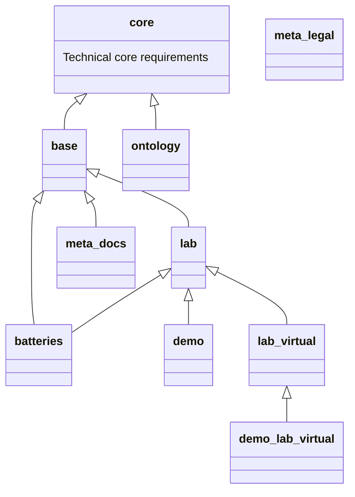

# osw-package-maintenance

Python scripts to build OSW page packages, common page package repositories as submodules

To add a package, run

```bash
git submodule add <package_repo> packages/<package_name>
```

e. g.

```bash
git submodule add https://github.com/OpenSemanticWorld-Packages/world.opensemantic.core packages/world.opensemantic.core
```

## Page packages



## Contribute

To contribute to this repository, please fork it and create a pull request.

When adding a new package, please add it and its dependencies (requiredPackages) to the mermaid dependency graph.
